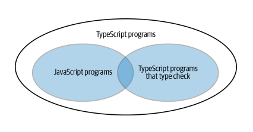

# What is Typescript ?

- TypeScript is JavaScript with syntax for types. This basically means that TypeScript adds syntax on top of JavaScript, allowing developers to add types. "TypeScript being a 'Syntactic Superset' means that it shares the same base syntax as JavaScript, but adds something to it."

- By definition, “TypeScript is JavaScript for application-scale development.”
  TypeScript is a strongly typed, object oriented, compiled language. It was designed by Anders Hejlsberg (designer of C#) at Microsoft. TypeScript is both a language and a set of tools. TypeScript is a typed superset of JavaScript compiled to JavaScript. In other words, TypeScript is JavaScript plus some additional features.

- All JavaScript programs are TypeScript programs, but the converse is not true: there are TypeScript programs which are not JavaScript programs. This is because Type‐
  Script adds additional syntax for specifying types

<div align="center"></div>
<br/>

For example : it's a valid typescript code

```typescript
function greet(who: string) {
  console.log("Hello", who);
}
```

But when you run this through a program like node that expects JavaScript, you’ll get
an error:

```javascript
function greet(who: string) {
 ^
SyntaxError: Unexpected token :
The : string is a type annotation that is specific to TypeScript.
```

**_So long as your JavaScript program doesn’t have any syntax errors then it is also a TypeScript program._**

<br/>
<hr />
<br/>

## Why we use Typescript ? Why TypeScript is developed while having JavaScript ?

- Before learning about TypeScript, let’s take a step back and revisit JavaScript. Since the earliest days of the World Wide Web, JavaScript has been used to make websites interactive – handle mouse and keyboard events, validate forms, and so on. With time, the language evolved. You can now use JavaScript to build websites and apps for any platform. It can be used to code both the frontend and backend of your website/app. You can build cross-platform apps using React Native and desktop apps with Electron, and you can even use JavaScript for your next IoT project! <br/><br/> With these extensive use cases, the complexity in the codebase increased. For smaller projects, using JavaScript is still fine. However, for larger projects, it became difficult to debug the code and catch errors.

- When JavaScript was developed, the JavaScript development team introduced JavaScript as a client-side programming language. But as people were using JavaScript, developers also realized that JavaScript could be used as a server-side programming language. However, as JavaScript was growing, JavaScript code became complex and heavy. Because of this, JavaScript wasn’t even able to fulfill the requirement of an Object-Oriented Programming language. This prevented JavaScript from succeeding at the enterprise level as a server-side technology. So TypeScript was created by the development team to bridge this gap.

- TypeScript extends JavaScript and improves the developer experience. It enables developers to add type safety to their projects. Moreover, TypeScript provides various other features, like **interfaces**, **type aliases**, **abstract classes**, **function overloading**, **tuple**, **generics**, etc.

<br/>
<hr />
<br/>

## What is relation between Typescript and Javascript ?

TypeScript is a superset of JavaScript but, how ? <br/>
If the statement that **_TypeScript is a superset of JavaScript_** feels wrong to you, it may be because you’re thinking of this third set of programs in the diagram. In practice, this is the most relevant one to the day-to-day experience of using TypeScript. Generally when you use TypeScript, you try to keep your code passing all the type checks.

<div align="center"></div>
<br/>

<br/>
<hr />
<br/>

## Difference between TypeScript and JavaScript ?

| Key                            |                                                                                          TypeScript                                                                                           |                                            JavaScript                                             |
| :----------------------------- | :-------------------------------------------------------------------------------------------------------------------------------------------------------------------------------------------: | :-----------------------------------------------------------------------------------------------: |
| Type                           |                                              Typescript is a strongly typed object-oriented `compiled language`. It was developed by Microsoft.                                               |        JavaScript is a lightweight `interpreted language`. It was introduced by Netscape.         |
| Data binding                   |                                      For binding the data at code level, Typescript uses concepts like types and interfaces to describe data being used.                                      |                        No such concept has been introduced in JavaScript.                         |
| Compilation                    |                        Code written in TypeScript first needs to get compiled and then converted to JavaScript. This process of conversion is known as Transpilation.                         |                          No compilation is needed in case of JavaScript.                          |
| Modular programming            |                                                               TypeScript supports modules, hence it allows modular programming.                                                               | JavaScript does not support modules and hence it does not allow modular programming (before ES6). |
| Optional parameter in function |                                                     Any number of optional parameters are allowed in function code written in Typescript.                                                     |                     JavaScript does not support optional parameter function.                      |
| Typing                         |                                                                                   Provides `static typing`                                                                                    |                                        `Dynamically typed`                                        |
| Syntax                         |                                                                        Similar to JavaScript, with additional features                                                                        |                                    Standard JavaScript syntax                                     |
| Debugging                      | Stronger typing can help identify errors, TypeScript always points out the compilation `errors at the time of development (pre-compilation)`. Because of this getting runtime errors is less. |          May require more debugging and testing, Javascript `errors occure at runtime`.           |
| Learning curve                 |                                                                          Can take time to learn additional features                                                                           |                              Standard JavaScript syntax is familiar                               |

<br/>
<hr />
<br/>

### Resources

- [https://www.tutorialspoint.com/typescript/typescript_overview.html](https://www.tutorialspoint.com/typescript/typescript_overview.html)
- [https://www.tutorialspoint.com/difference-between-typescript-and-javascript](https://www.tutorialspoint.com/difference-between-typescript-and-javascript)
- [https://www.sanity.io/typescript-guide/typescript-vs-javascript](https://www.sanity.io/typescript-guide/typescript-vs-javascript)
- [https://www.contentful.com/blog/what-is-typescript-and-why-should-you-use-it/](https://www.contentful.com/blog/what-is-typescript-and-why-should-you-use-it/)
- [https://www.geeksforgeeks.org/difference-between-typescript-and-javascript/](https://www.geeksforgeeks.org/difference-between-typescript-and-javascript/)
- [https://www.w3schools.com/typescript/typescript_intro.php](https://www.w3schools.com/typescript/typescript_intro.php)
